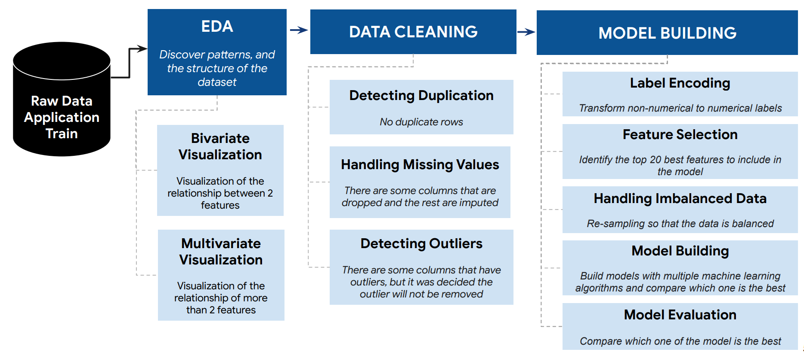
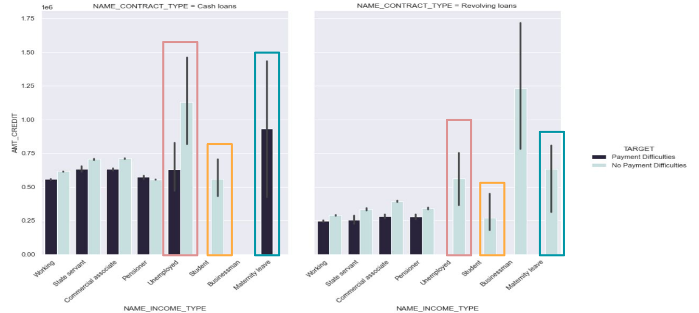

# HomeCredit : ScoreCard Model

## Bussiness Understanding

Banyak orang mengalami kesulitan mendapatkan pinjaman karena riwayat kredit yang tidak mencukupi atau bahkan tidak ada sama sekali. Home Credit berupaya untuk memperluas inklusi keuangan bagi mereka yang tidak memiliki akses perbankan dengan menyediakan pengalaman peminjaman yang positif dan aman. Untuk memastikan bahwa populasi yang kurang dilayani ini memiliki pengalaman pinjaman yang positif, Home Credit memanfaatkan berbagai data alternatif untuk memprediksi kemampuan pembayaran klien mereka. Dengan melakukannya, diharapkan klien yang mampu untuk membayar tidak ditolak dan pinjaman diberikan dengan prinsipal, jangka waktu, dan jadwal pembayaran yang akan memberdayakan klien untuk meraih kesuksesan.

## Goals

Untuk mengatasi permasalahan tersebut, sebagai Data Scientist tim kami mengusulkan beberapa tujuan untuk mencapai tujuan tersebut, sebagai berikut:

1. Mengidentifikasi karakteristik dari calon klien yang mungkin mengalami kesulitan dalam melunasi pinjaman.
2. Memprediksi kemampuan pembayaran klien.

## End-to-End Schema with ETL Processing with KNIME

## Insights

1. Semua klien yang merupakan mahasiswa tidak mengalami kesulitan dalam melunasi pinjaman, baik itu pinjaman tunai atau pinjaman bergulir, untuk jumlah pinjaman yang rendah hingga menengah.
2. Untuk tipe penghasilan cuti melahirkan dengan pinjaman tunai, semua klien mengalami masalah dalam melunasi pinjaman untuk jumlah pinjaman yang sedang. Sementara semua klien dengan cuti melahirkan dan pinjaman bergulir tidak mengalami kesulitan dalam melunasi pinjaman.
3. Untuk klien yang tidak bekerja dengan pinjaman tunai, lebih dari 50% dari mereka mengalami masalah dalam melunasi pinjaman dengan jumlah kredit yang sedang. Sementara semua klien yang tidak bekerja dengan pinjaman bergulir tidak mengalami kesulitan dalam melunasi pinjaman.

## Suggest
Seorang klien dengan tipe penghasilan sebagai mahasiswa dapat dikatakan sebagai klien yang mampu melunasi pinjaman, baik dengan pinjaman tunai maupun pinjaman bergulir (100% dari aplikasi disetujui). Namun, hanya ada 0,005% dari jumlah aplikasi yang berasal dari mahasiswa.

Seorang klien yang bekerja sebagai akuntan dapat dikatakan mampu melunasi pinjaman (95% dari aplikasi disetujui). Namun, hanya ada 3.19% dari jumlah aplikasi yang berasal dari seorang akuntan. Begitu juga dengan klien yang bekerja sebagai staf teknologi tingkat tinggi dan manajer, mereka mampu melunasi pinjaman, namun hanya sedikit aplikasi yang berasal dari mereka.

Buatlah kampanye agar lebih banyak mahasiswa, akuntan, staf teknologi tingkat tinggi, dan manajer tertarik untuk mengajukan pinjaman.

